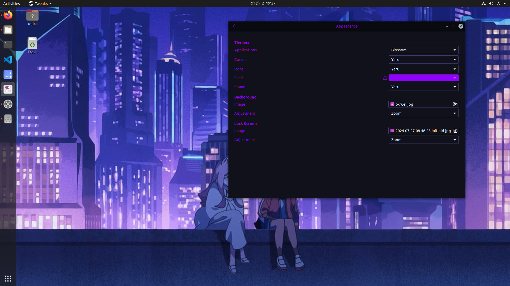
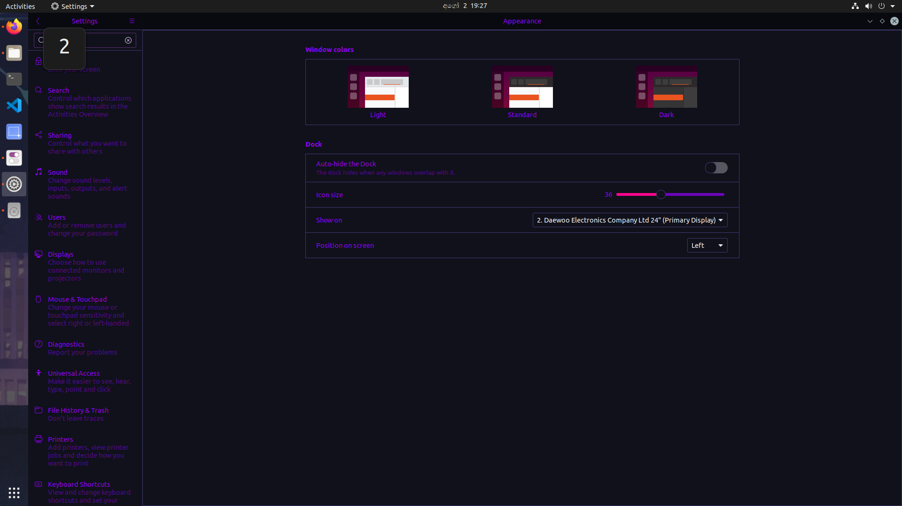
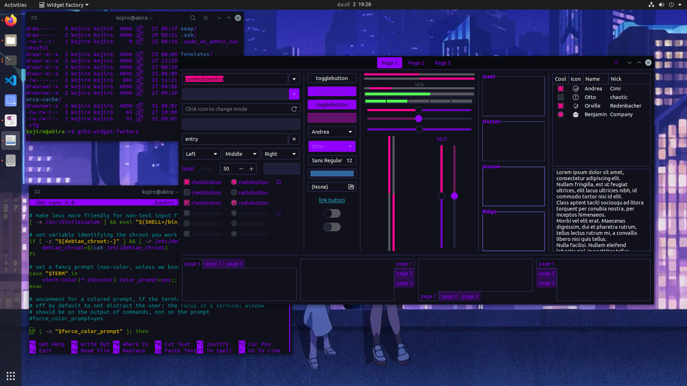

# Blossom Theme for [App/Service/etc... Name]

## Preview




## Installation
1. Download the latest version from the ```release``` section.
2. Extract it and copy to ```~/.themes```.
3. Use a tool like Gnome Tweaks to change the theme.
4. Enjoy the theme.
